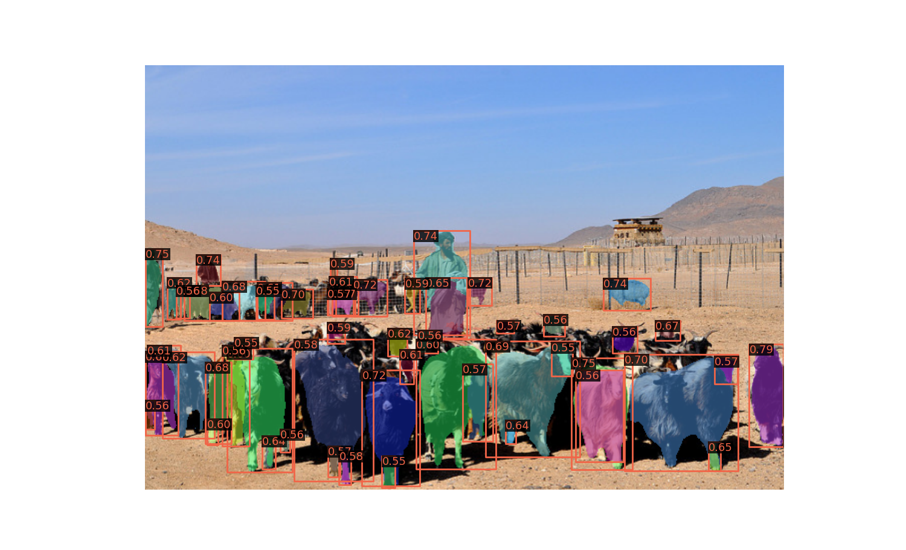
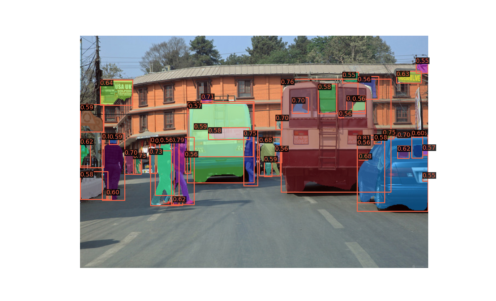

# OLN-Mask

## Unofficial implementation of OLN-Mask from [Learning Open-World Object Proposals without Learning to Classify](https://ieeexplore.ieee.org/stamp/stamp.jsp?arnumber=9697381)<br/>

This repository is a for of the code for [OLN](https://github.com/mcahny/object_localization_network) containing an implementation of 
OLN-Mask, which is not included in [the original repo](https://github.com/mcahny/object_localization_network).

  <br/>

OLN-Mask contains the following new modules:

 - **MaskScoringOlnRoIHead** (RoI Head). Similar to OlnRoIHead, it includes mask forward and testing methods. It also implements
the detection score as the geometric mean of the RPN, the BBox head and the mask head. 
 - **OlnFCNMaskHead** (Mask Head). Similar to FCNMaskHead, but it returns the features after the convolutional layers.
 - **OlnMaskIoUHead** (Mask IoU Head). Mask scoring IoU Head, as explained in the paper. The architecture follows the same
 as in MaskScoring, but with a convolutional network at the beginning.

This repo also has some modifications for better mask visualisation.

## Metrics

OLN-Mask is trained following the original paper implementation and similar OLN-Box. Here we compare our results with the OLN-Mask results reported in the paper.
We only present COCO train2017 (VOC categories) --> Coco val2017 (non VOC categories) results.

|                                      Method                                      | Box AR@10 | Box AR@30 | Box AR@100 | Box AR@300 | Mask AR@10 | Mask AR@30 | Mask AR@100 | Mask AR@300 |                                            Download                                            |
|:--------------------------------------------------------------------------------:|:---------:|:---------:|:----------:|:----------:|:----------:|:----------:|:-----------:|:-----------:|:----------------------------------------------------------------------------------------------:|
| OLN-Box ([paper](https://ieeexplore.ieee.org/stamp/stamp.jsp?arnumber=9697381))  |   18.0    |   26.4    |    33.4    |    39.0    |    N/A     |    N/A     |     N/A     |     N/A     |           [model](https://drive.google.com/uc?id=1uL6TRhpSILvWeR6DZ0x9K9VywrQXQvq9)            |
| OLN-Mask ([paper](https://ieeexplore.ieee.org/stamp/stamp.jsp?arnumber=9697381)) |   18.3    |     -     |    33.6    |     -      |    16.9    |     -      |    27.8     |      -      |                                               -                                                |
|                               OLN-Mask (This repo)                               |   18.2    |   26.2    |    33.7    |    38.7    |    17.2    |    23.4    |    28.6     |    31.3     | [model](https://drive.google.com/file/d/1_8X8getp3FK_uKrI6Dcl0Xy5c_RVgabO/view?usp=drive_link) |


## Disclaimer

This repo is tested under Python 3.7.12, PyTorch 1.7.1, Cuda 11.7, and mmcv==1.2.7. Follow the same instructions for installation as in
[OLN](https://github.com/mcahny/object_localization_network).

## Prepare datasets

COCO dataset is available from official websites. It is recommended to download and extract the dataset somewhere outside the project directory and symlink the dataset root to $OLN/data as below.
```
object_localization_network
├── mmdet
├── tools
├── configs
├── data
│   ├── coco
│   │   ├── annotations
│   │   ├── train2017
│   │   ├── val2017
│   │   ├── test2017

```


## Testing
OLN-Box is available [here](https://drive.google.com/uc?id=1uL6TRhpSILvWeR6DZ0x9K9VywrQXQvq9) (original source from OLN repo). To evaluate, run:

```
# Multi-GPU distributed testing
bash tools/dist_test_bbox.sh configs/oln_box/oln_box.py \
work_dirs/oln_box/latest.pth ${NUM_GPUS}
# OR
python tools/test.py configs/oln_box/oln_box.py work_dirs/oln_box/latest.pth --eval bbox
```

Similarly, OLN-Mask is available [here](). For testing, run:
```
python tools/test.py configs/oln_mask/oln_mask.py work_dirs/oln_mask/latest.pth --eval bbox segm
```

## Contact
Any question regarding OLN-Mask implementation, please create a new issue. For other OLN-related questions please refer to the original repo issues page. 